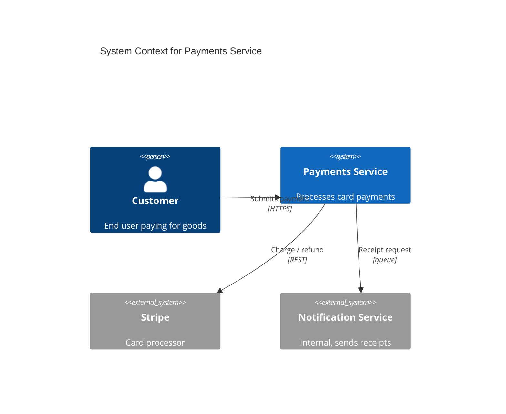
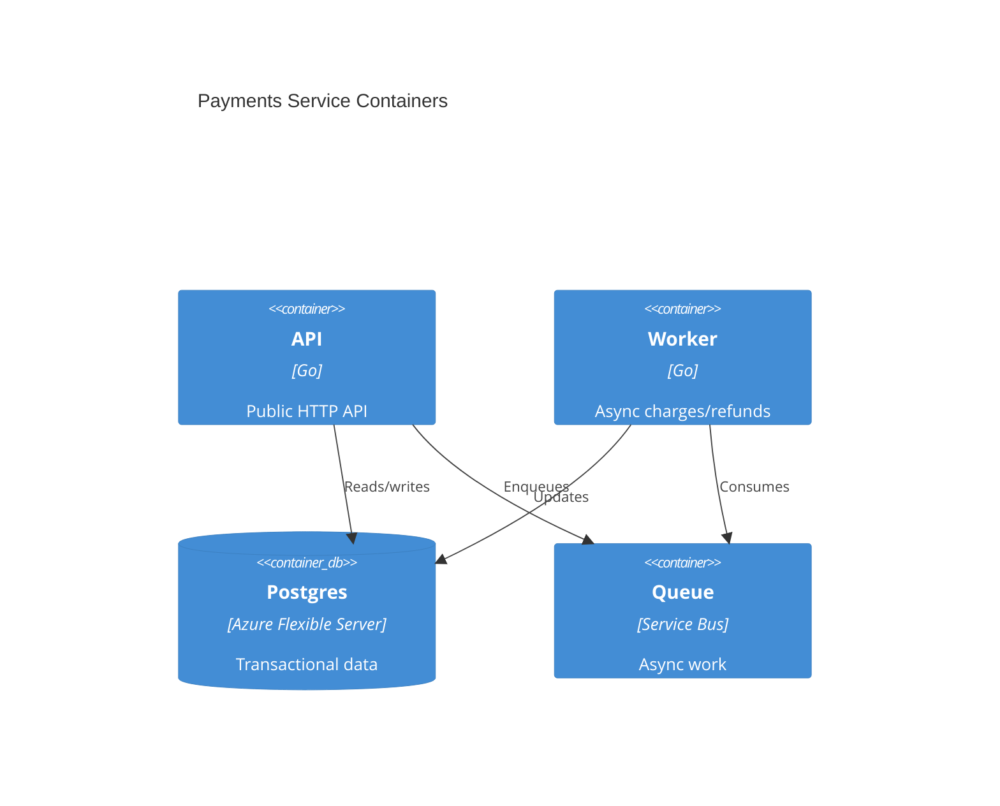

# Architecture documentation that survives

**TL;DR:** Most architecture docs rot within six months because they're disconnected
from the code, written for an audience that doesn't read them, and stored where nobody
looks. The four artifacts that actually survive: a C4 context diagram, a per-service
README, ADRs in the repo, and a single living "system overview" page that links to
them. Everything else is performance art.

## Why most architecture docs rot

The pattern is always the same:

1. Big upfront design doc (40 pages, several Mermaid diagrams).
2. Approval ritual.
3. Doc lives in Confluence / SharePoint / Notion.
4. Six months later: code has drifted, doc still says the original plan, nobody
   trusts the doc, nobody updates the doc, nobody reads the doc.

The doc was never going to survive because:

- **It lived away from the code.** Nothing in the dev loop forces an update.
- **It tried to capture everything.** Big docs are abandoned faster than small ones.
- **It mixed decision and design and how-to.** Each ages at a different rate.
- **It had no owner.** Owned-by-everyone = owned-by-nobody.

The fix is the opposite of "more documentation". It's **less, smaller, closer to
the code, and split by lifespan.**

## The four artifacts that survive

Split docs by how often they should change, then put each in the right place.

| Artifact | Lives in | Changes when | Audience |
|---|---|---|---|
| **System overview** | Wiki / docs site | Major topology shift | Anyone (exec to engineer) |
| **C4 context diagram** | Repo (Mermaid/Structurizr) | New external system added | Anyone |
| **Service READMEs** | The service's repo | Service changes | Engineers on that service |
| **ADRs** | `docs/adr/` in the relevant repo | A new decision is made | Engineers + reviewers |

That's it. No 40-page design doc. No "architecture handbook". No "platform manifesto".

Each artifact has one job and one update trigger.

## C4 model — pragmatic version

C4 (Context, Containers, Components, Code) is a 4-level zoom model. In practice
you need *two* of the four levels:

- **Level 1: System context** — your system as a box, the people who use it, the
  external systems it talks to. **This is the one diagram everyone needs.**
- **Level 2: Containers** — what runs where. Services, databases, queues. The
  diagram engineers actually use for orientation.

Levels 3 (components) and 4 (code) are usually overkill. If you need level 3,
you're probably documenting a single complicated service — do it in *that
service's* README, not in a system-wide diagram.

### Mermaid for C4

You can author C4 in Mermaid right next to the code. Renders on GitHub.



Container diagram (level 2):



Two diagrams in a repo. That's it.

## Service READMEs — the most under-rated doc

For each service repo, a `README.md` with this exact shape:

```markdown
# Payments Service

One-paragraph description of what this service does and who consumes it.

## Architecture
Link to the container diagram (`./docs/architecture.md` or external).

## Local development
- Prerequisites
- Setup commands
- Common tasks (run tests, regenerate fixtures, lint)

## Deployment
How CI/CD deploys this. Which environments. How to roll back.

## Runbook
Common incidents and how to handle them. Or link to a runbook folder.

## Decisions
Link to the relevant ADRs.

## Owners
Team name. Slack channel. On-call rotation link.
```

Six sections. None of them rot fast (the deployment section rots slowest because
CI/CD changes infrequently). When someone joins the team, this is the doc they
read. Keep it brutally tight.

## ADRs in the repo

See [`well-architected-decisions.md`](./well-architected-decisions.md) for the
template. The key point for documentation hygiene:

- ADRs live in `docs/adr/` in the repo whose code they govern.
- Numbered sequentially: `0001-use-postgres.md`, `0002-..., 0003-...`.
- Immutable once accepted (new ADR supersedes old).
- Linked from the service README's "Decisions" section.

ADRs survive because they're append-only. You can't "update" an ADR into being
wrong — you write a new one that says the old one is superseded.

## The "system overview" page

One page. Lives in the wiki (or `docs/` in a meta-repo). Job: orient new people
and execs in 5 minutes.

Contents:

- 1-paragraph description of what the system does.
- The C4 context diagram (embedded or linked).
- A table of services with one-line descriptions and links to their repos.
- The top 3-5 ADRs that defined the shape of the system.
- "Who to ask about X" — team owners.

That's it. No detail. The detail is in the service READMEs.

Update trigger: a new service is added, removed, or fundamentally reshaped.
Roughly quarterly for a healthy system.

## Diagrams as code — the tools

| Tool | Strength | Weakness |
|---|---|---|
| **Mermaid** | Renders on GitHub natively. C4 support. Zero setup. | Layout can be ugly for complex graphs. |
| **PlantUML** | Powerful, mature, C4 stdlib. | Needs a renderer; not native on GitHub. |
| **Structurizr** | Built for C4. DSL is elegant. Free Lite version. | Separate service to run; sharing requires it. |
| **draw.io / diagrams.net** | WYSIWYG. Store XML in the repo. | Drift between XML and rendered PNG. |
| **Excalidraw** | Beautiful sketches. Plays nice with VS Code. | Not "diagrams as code" in the strict sense. |

The default answer is **Mermaid** for diagrams that live with the code (renders
on GitHub, no tooling required) and **Structurizr** for teams that need a single
canonical model across many repos.

PowerPoint and Visio belong in the trash for this use case. They drift the day
after the meeting that produced them.

## Anti-patterns that look like documentation

- **The wiki dump** — 200 pages, no curation, all out of date. Worse than no
  docs because newcomers waste hours reading lies.
- **Auto-generated everything** — Swagger/OpenAPI is great for *APIs*, useless
  as "the architecture doc".
- **Slides as documentation** — a 60-slide deck is not a doc. It's a
  presentation. Convert the canonical content to prose.
- **Whiteboard photos in Slack** — captures the moment, helps zero people next
  quarter.
- **"See this Google Doc"** — Google Docs are great for drafting, terrible as
  the source of truth. Move accepted content to the repo.
- **The "architecture review" channel** — async comments on a doc nobody owns
  is theatre.

## Keeping docs in sync with reality

The only sustainable mechanism: **make the doc update part of the PR that
changes the system.**

- PR template includes "Did this require a doc update? Y/N — if Y, link to it."
- CI lint that warns when service code changes and the README hasn't been
  touched in N months.
- Quarterly "doc rot review" — 30 min, walk the system overview, file tickets
  for stale sections. (This is the same ritual as the DR drill.)

Without one of these, docs decay at a half-life of about 4 months.

## Gotchas

- **Diagrams of "the future state" without dates** become aspirational fiction
  immediately. Date them or skip them.
- **A doc with no owner** is a doc with no future updates. Always name an owning
  team (not a person).
- **Mixing "what we have" with "what we wish we had"** confuses readers. Keep
  current-state and target-state in separate documents.
- **Documentation as a deliverable for a project** dies when the project ends.
  Documentation as a *living* asset of the *team* survives.
- **Don't document the obvious.** "We use HTTPS" doesn't need a paragraph. Link
  to standards; document the deviations.
- **Don't paste tool output.** Console screenshots, `kubectl get pods` output —
  these are out of date the moment they're saved. Reference the command instead.

## When NOT to write architecture docs

- **Solo project, never to be handed off.** The code is the doc.
- **3-engineer team, all in one room.** Until you scale past Dunbar-team-size,
  high-bandwidth conversation beats async docs for most decisions.
- **Prototype.** Write ADRs only for things you'll keep. Skip the diagrams.

But: if it's *production*, somebody is on call. They need at minimum a service
README and a runbook. Always.

## Related

- [`well-architected-decisions.md`](./well-architected-decisions.md) — the ADR
  template and trade-off framing.
- [`disaster-recovery-playbook.md`](./disaster-recovery-playbook.md) — runbook
  anatomy, which is the operational counterpart to a service README.
- [`../agent-workspaces/portable-agent-workspace-pattern.md`](../agent-workspaces/portable-agent-workspace-pattern.md)
  — context-as-code for agents, conceptually similar to docs-as-code for humans.
- [`../automation-patterns/pr-as-publish-gate.md`](../automation-patterns/pr-as-publish-gate.md)
  — how to make doc updates part of the PR flow.
